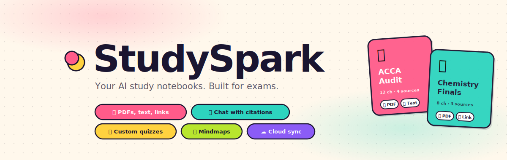

<div align="center">



# StudySpark

**Your AI-powered exam prep companion. Bundle PDFs, web links, and notes into living study notebooks with chat, citations, quizzes, flashcards, and mindmaps.**

[Features](#-features) · [Quick Start](#-quick-start) · [Setup Guide](#-setup-guide) · [Screenshots](#-screenshots) · [FAQ](#-faq)

</div>

---

## What it is

StudySpark is a NotebookLM-style web app you can self-host on GitHub Pages for free. It runs entirely in your browser (no backend to maintain), uses Google's Gemini API for the AI bits, and syncs your study material across all your devices via Firebase.

You upload your study material, ask questions about it, and get exam-ready answers grounded in your own sources, with inline citations you can click to see the original passage. Then auto-generate study aids, mindmaps, flashcards, and custom quizzes from the same material.

Built for students preparing for professional exams (ACCA, CFA, bar exams, medical boards), university finals, certification courses, and anyone studying from substantial text material.

## ✨ Features

### Notebooks, not just one PDF
Each notebook bundles **multiple sources**: PDFs, pasted text, and web links. Build a notebook per exam, module, or course. Each notebook has its own chat history, study aids, and quiz results.

### Chat with citations you can verify
Ask anything about your material. Answers come back with inline `[1.4]` citation pills, click any one to see the exact source passage. If a citation seems off, the popup includes a **search box** to find the actual passage by keyword.

### Auto-generated study aids
For each notebook, generate on demand:
- **📋 Briefing Document** — overview with key themes and critical takeaways
- **📖 Study Guide** — comprehensive guide with key terms, concepts, relationships, exam focus
- **❓ FAQ** — 10-12 likely exam questions with detailed model answers

### Custom quizzes with chapter filtering
StudySpark auto-detects chapter structure in your PDFs and lets you quiz **just Chapter 1**, or any specific chapter. Pick:
- Number of questions (5, 10, 15, 20, 30)
- Difficulty (easy, medium, hard)
- Question types (multiple choice, true/false, short answer)
- Custom focus instructions ("focus on formulas", "exclude historical context", etc.)

Each question shows explanations after you answer, and your scores are tracked.

### Hierarchical mindmaps
3-level deep visual mindmaps: **central topic → chapters → concepts → specific details**. View as a horizontal tree, radial layout, or compact list. Download as PNG for sharing or revision sessions.

### Flashcards for active recall
Auto-generated flashcards from your sources. Tap to flip. Smooth 3D card animation.

### Cloud sync across all your devices
Sign in with Google once. Your notebooks, chats, quiz results, and even your Gemini API key sync in real-time across phone, laptop, tablet. Built on Firebase Firestore (free tier covers all personal use).

### Mobile-friendly PWA
Add to home screen on iPhone or Android for a native app feel. Three-column desktop layout collapses to a clean tab-based mobile UI.

### Privacy-first by design
- Single-user app with **email allowlist** (only you can sign in)
- All data lives in **your own Firebase project**, not third-party servers
- Optional **passcode lock** on top of Google auth
- Source PDFs never leave your device, only extracted text gets synced

---

## 🚀 Quick Start

If you just want to try it out without any setup:

1. Download `index.html` from this repo
2. Open it in any modern browser
3. Set a passcode
4. Click "Add API key" → paste a [free Gemini API key](https://aistudio.google.com/apikey)
5. Click "Create notebook" and start uploading PDFs

That's it. No backend, no sync, no Firebase needed. Just a single HTML file.

For cross-device sync, follow the [full setup guide](#-setup-guide) below.

---

## 📋 Setup Guide

The full setup unlocks **Google sign-in, real-time cloud sync, and email-allowlisted access**. Takes about 10 minutes.

### Step 1: Create a Firebase project

1. Go to [console.firebase.google.com](https://console.firebase.google.com)
2. Click **Add project** → name it (e.g. `studyspark`)
3. Disable Google Analytics (not needed)
4. Wait for provisioning, click Continue

### Step 2: Add a web app

1. On the project home, click the `</>` web icon
2. App nickname: anything (e.g. `studyspark-web`)
3. **Don't** enable Firebase Hosting
4. Copy the three values from the snippet:
   - `apiKey`
   - `authDomain`
   - `projectId`

### Step 3: Enable Authentication

1. **Build → Authentication → Get started**
2. **Sign-in method** tab → click **Google** → toggle **Enable** → save
3. **Settings** tab → **Authorized domains** → **Add domain** → enter your GitHub Pages domain (e.g. `yourname.github.io`)

### Step 4: Set up Firestore

1. **Build → Firestore Database → Create database**
2. Pick a location close to you (can't be changed later)
3. Start in **production mode**
4. Once created, go to **Rules** tab and paste:

```javascript
rules_version = '2';
service cloud.firestore {
  match /databases/{database}/documents {
    match /users/{userId}/{document=**} {
      allow read, write: if request.auth != null && request.auth.uid == userId;
    }
  }
}
```

5. Click **Publish**

### Step 5: Restrict your API key (important for security)

The Firebase config you paste in step 6 is safe to commit publicly (see the [security note](#-on-firebase-config-being-exposed)), but you should still lock the key down to your domain:

1. Go to [console.cloud.google.com](https://console.cloud.google.com) (same Google account)
2. Select your Firebase project from the top dropdown
3. **APIs & Services → Credentials**
4. Click the API key (named something like "Browser key (auto created by Firebase)")
5. Under **Application restrictions**, select **HTTP referrers (websites)** and add:
   - `https://yourname.github.io/*`
   - `http://localhost/*` (for local testing)
6. Under **API restrictions**, select **Restrict key** and check only:
   - Identity Toolkit API
   - Token Service API
   - Cloud Firestore API
   - Firebase Installations API
7. Click **Save**

Now the key only works from your specific domain.

### Step 6: Configure StudySpark

Open `index.html` in any text editor. Search for `EMBEDDED_CONFIG` (near the top of the script). Edit:

```javascript
const EMBEDDED_CONFIG = {
  enabled: true,

  projectId: 'YOUR_PROJECT_ID_HERE',          // paste from Step 2
  apiKey:    'YOUR_FIREBASE_API_KEY_HERE',    // paste from Step 2
  authDomain:'YOUR_AUTH_DOMAIN_HERE',         // paste from Step 2

  allowedEmails: [
    'your-email@gmail.com',                    // your Google email, lowercase
  ],
};
```

Save the file.

### Step 7: Deploy to GitHub Pages

1. Create a new repo on github.com (public is fine; the config is safe to commit)
2. Upload your edited `index.html`
3. **Settings → Pages → Source: Deploy from branch → main → / (root) → Save**
4. Wait ~1 minute, your app is live at `https://YOUR-USERNAME.github.io/REPO-NAME/`

### Step 8: Sign in & start studying

1. Open the URL on your laptop or phone
2. Set a passcode (per-device)
3. Click **Sign in with Google**
4. Click "Add API key" in the sidebar, paste your [Gemini API key](https://aistudio.google.com/apikey)
5. The key syncs to your other devices automatically
6. Create a notebook, add sources, start studying

---

## 📸 Screenshots

> Screenshots from a live deployment will be added here. To capture your own:
> 1. Deploy your StudySpark instance following the setup guide above
> 2. Take screenshots using your browser's built-in tool or Cmd/Ctrl + Shift + 4
> 3. Save them in the `docs/` folder
> 4. Update this section with the image paths

**Suggested screenshots to capture:**

| View | What to show |
|------|--------------|
| `docs/home.png` | Dashboard with several notebooks and stats |
| `docs/notebook.png` | Three-panel layout: sources, chat with citations, studio |
| `docs/citation.png` | Citation popup with source passage and search box |
| `docs/study-guide.png` | Auto-generated study guide modal |
| `docs/mindmap.png` | Mindmap in tree view |
| `docs/quiz.png` | Quiz player mid-question with explanation shown |
| `docs/signin.png` | Sign-in screen (for showcasing the auth flow) |

Once captured, embed them with:

```markdown


```

---

## 🔒 On Firebase config being "exposed"

If you're concerned about your Firebase `apiKey` and `projectId` being visible in your public GitHub repo: **this is intentional and safe**. Firebase API keys are public identifiers, not secrets, similar to a Stripe publishable key or a Google Maps embed key.

Real security comes from three layers, all configured in your Firebase Console:

1. **Firestore security rules** — only authenticated users can read/write, and only their own data
2. **Email allowlist** in `EMBEDDED_CONFIG.allowedEmails` — only your specific Google email can sign in
3. **Authorized domains** + **API key restrictions** — requests must originate from your GitHub Pages URL

Even if someone clones your entire repo with all keys visible, they cannot sign in (allowlist blocks them), cannot read/write data (Firestore rules require auth), and cannot use the keys from a different domain (Firebase rejects unauthorized origins).

If you'd like to verify this yourself, Firebase has documented it [here](https://firebase.google.com/docs/projects/api-keys).

That said, **always complete Step 5 (API key restrictions)** as defense in depth.

---

## 🔧 How it works (technical overview)

**StudySpark is one HTML file.** All CSS, JavaScript, and assets are inline. It runs as a Progressive Web App (PWA) and can be added to your phone's home screen for a native app experience.

### Architecture
- **Frontend**: Vanilla JavaScript (no framework). All state managed in a single `state` object with explicit `render()` calls
- **PDF parsing**: PDF.js (loaded from CDN), with custom positional-aware text extraction
- **AI**: Google Gemini 2.5 Flash via the REST API (free tier: 1,500 requests/day)
- **Auth**: Firebase Authentication (Google provider) with email allowlist
- **Storage**: Local: browser `localStorage`. Cloud: Firebase Firestore
- **Hosting**: Static file on GitHub Pages, Netlify, Cloudflare Pages, or anywhere

### Citation system
Each source is split into chunks (~1800 characters). When generating answers or study aids, chunks are wrapped with `--- BEGIN PASSAGE [S1:3] ---` markers in the prompt. The AI is instructed to cite using the exact markers, and the rendered output replaces `[S1:3]` with clickable pills. Junk passages (TOC, copyright, exam admin) are filtered at upload time so they never get cited.

### Data sync model
Each user's data lives at `/users/{firebaseUid}/...` in Firestore:
- `state/main` — notebooks (without source text), chat history, quiz results
- `sources/{sourceId}` — source text and chunks (one doc per source to avoid 1MB doc limit)
- `config/main` — Gemini API key

Real-time updates via Firestore `onSnapshot`, debounced writes via 1.5s timer. Last-write-wins for conflicts.

### Stack at a glance

| Layer | Tech |
|-------|------|
| UI | Custom CSS + Fraunces (display) + Outfit (body) + JetBrains Mono |
| Routing | Single-page, state-driven render |
| PDF parsing | PDF.js 3.11 (CDN) |
| LLM | Gemini 2.5 Flash (responseMimeType: application/json) |
| Auth | Firebase Auth 12.13 (Google provider) |
| Database | Firestore (free tier) |
| PWA | Inline manifest + service-worker-free design |

---

## 🐛 FAQ

### Is my data private?
Yes. Your data lives in your own Firebase project under your Google account. No third party sees it. The HTML file is public (because GitHub Pages requires public repos for free), but the API keys it contains are public Firebase keys designed to be safe in client code. Real security comes from Firestore rules, the email allowlist, and the optional passcode.

### What does it cost to run?
**Free.** Firebase free tier: 50K reads/day, 20K writes/day, 1GB storage. Gemini free tier: 1,500 requests/day. GitHub Pages: unlimited bandwidth for personal use. You'll use under 1% of these limits as a single user.

### Can multiple people use it?
Yes. Add their emails to the `allowedEmails` array in `EMBEDDED_CONFIG`. Each person gets their own data (scoped to their Google UID). Useful for family sharing or small study groups.

### What if I lose my Gemini API key?
Re-issue one at [aistudio.google.com/apikey](https://aistudio.google.com/apikey). Paste it into StudySpark; it syncs to all your devices.

### What if I forget my passcode?
The passcode is hashed in `localStorage`, not recoverable. Clear site data in your browser → set a new passcode. Your cloud data (notebooks, chats, etc.) is untouched.

### Why Gemini and not GPT-4 / Claude?
Gemini 2.5 Flash has the most generous free tier (1,500 req/day vs OpenAI's none), native JSON mode for reliable quiz structure, and a 1M-token context window that handles entire textbooks without chunking. For a personal study app where you might generate 50-100 things a day, the free tier is more than enough. The code is easy to adapt to other providers if you'd rather use OpenAI or Anthropic.

### My citations are inaccurate. Why?
This is a known limitation of using a small free-tier model over long documents. The AI guesses chunk numbers from positional cues and isn't always right. StudySpark includes a **search box in the citation popup** specifically for this: if a citation seems wrong, search the source for the term and you'll instantly find the real passage.

### Can I export my data?
Yes. Sidebar → **⬇️ Export backup** downloads a JSON file with everything (notebooks, chats, results). Sidebar → **⬆️ Import backup** restores it. Useful for periodic safety backups or migrating to a different Firebase project.

### Can I run this without Firebase?
Yes. Set `enabled: false` in `EMBEDDED_CONFIG`. The app reverts to passcode-only mode with localStorage. You lose cross-device sync but everything else works.

---

## 🤝 Contributing

This is a personal study tool, but if you find bugs or have ideas, open an issue or PR. The entire app is one HTML file, easy to understand and modify.

Key areas where contributions would be valuable:
- Better PDF text extraction (especially for scanned/OCR documents)
- More accurate citation grounding (maybe vector embeddings + similarity search?)
- Voice input / audio overview generation (Web Speech API)
- More export formats (Anki deck, Markdown bundle)
- More LLM provider options (OpenAI, Anthropic, Groq, OpenRouter)

---

## 📄 License

MIT License — feel free to use this for your own studying or as a starting point for your own apps.

---

<div align="center">

Built for serious learners. ✨

</div>
